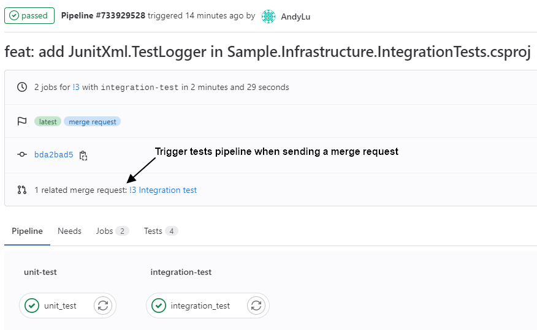
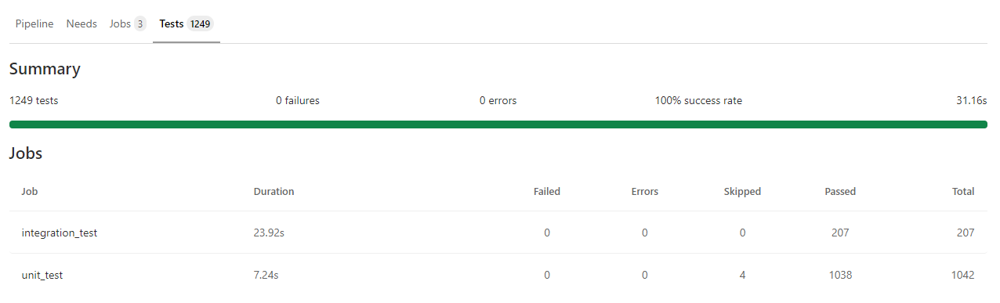
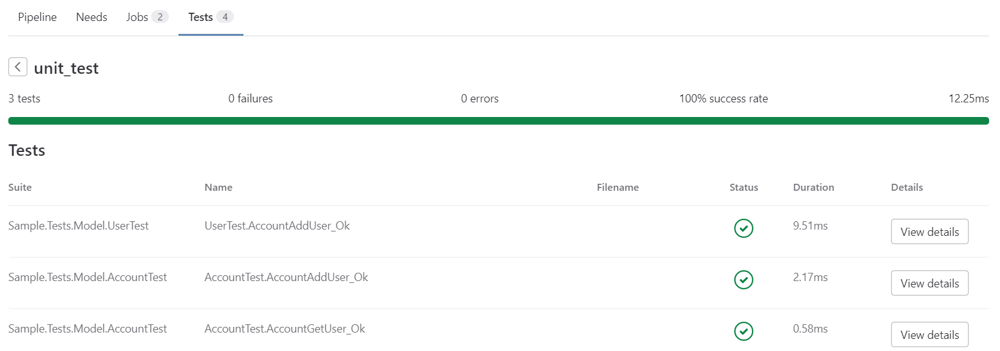
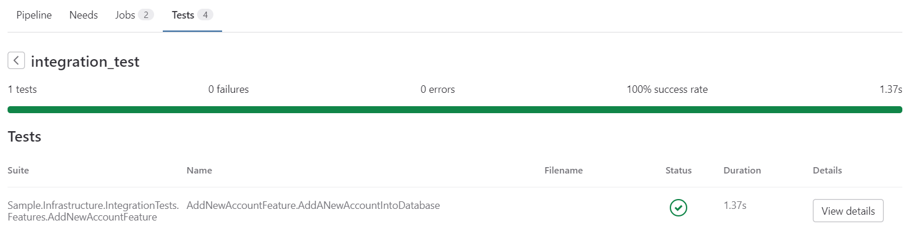

# Unit tests and Integration tests in GitLab CI

In this article, you can learn how to  

1. Include unit tests in your GitLab CI pipeline.
2. Include integration tests and external dependencies used in your integration test projects, such as PostgreSQL, in your GitLab CI pipeline.
3. Preview your test reports on GitLab.

## Demo

[Tests in CI demo project in GitLab](https://gitlab.com/my-group1177/tests-in-ci-demo)

## Prerequiste

1. test projects in .NET 6
2. [JunitXml.TestLogger](https://www.nuget.org/packages/JunitXml.TestLogger) in your test projects for test reports
3. A GitLab Runner
4. `.gitlab-ci.yml` for GitLab Runner

## Purpose

Integrating tests, including unit tests and integration tests, in your CI pipeline in GitLab.

## Configuration

Let me give you some examples first, and I will explain the details later.

In the directory, `Sample.Tests` is a unit test project and `Sample.Infrastructure.IntegrationTests` is a integration test project.

```plain
$tree -a
.
├──.gitlab
│   └───test.yml
├──.gitlab-ci.yml
└──test
   ├───Sample.Tests
   │   ├───Sample.Tests.csproj
   │   └───(...)
   └───Sample.Infrastructure.IntegrationTests
       ├───Sample.Infrastructure.IntegrationTests.csproj
       └───(...)
```

In `.gitlab-ci.yml`

```yaml
stages:
  - unit-test
  - integration-test

include:
  # run unit/integration test
  - local: .gitlab/test.yml
```

In `test.yml`, we have two [jobs](https://docs.gitlab.com/ee/ci/jobs/) (terminology in GitLab), one is for unit tests and the other one is for integration tests.  

First, let us talk about the details of job `unit_test` blocks by blocks.

- stage: stage name(here is `unit-test`)
- image: image used in GitLab runner.
- script: We will go to different directories which include `.Tests` at the end of the directory name. Then, executing each test project through the `dotnet test` command. Significantly, we have some special arguments in command, such as `--test-adapter-path` and `--logger`, and those arguments are for [test reports in .NET](https://docs.gitlab.com/ee/ci/testing/unit_test_report_examples.html#net).
- artifacts: You can store your test reports as artifacts in specific paths in GitLab. Thus, you can see your test reports on GitLab. Notice that GitLab would classify your test reports according to test reports file names.
- only: We only trigger our tests pipeline in GitLab CI when we send a Merge Request.

Second, let us talk about the details of job `integration_test` blocks by blocks.

- stage: stage name(here is `integration-test`)
- services: Because we rely on PostgreSQL in our integration test project, we have to set up an extra container for PostgreSQL. Here, we can prepare for PostgreSQL easily by using a feature provided by GitLab called [services](https://docs.gitlab.com/ee/ci/services). In services, we can set up different external dependencies, such as Redis, MySQL and PostgreSQL, by specifying the image name. We only use PostgreSQL here.
- script: We will go to different directories which include `.IntegrationTest` at the end of the directory name. Then, execute each test project through the `dotnet test` command. Significantly, we have some special arguments in command, such as `--test-adapter-path` and `--logger`, and those arguments are for [test reports in .NET](https://docs.gitlab.com/ee/ci/testing/unit_test_report_examples.html#net).
- (**Notice**) before_script: Because services in GitLab runner have different host name, for example, PostgreSQL service host name in GitLab runner is `postgres`, but in local might be `localhost`, we have to overwrite the config file used in test projects. For here, `secrets.json` is the config file for running tests locally, and `secrets.gitlab.IntegrationTests.json` is the config file for running tests in GitLab. Please see [my demo project](https://gitlab.com/my-group1177/tests-in-ci-demo) for more details.
- variables: You can set up your own environment variables for GitLab runner, but here, we only set up [necessary environment variables](https://docs.gitlab.com/ee/ci/services/postgres.html) for PostgreSQL.

In `test.yml`

```yml
unit_test:
  stage: unit-test
  tags:
    - docker
  image: mcr.microsoft.com/dotnet/sdk:6.0 
  before_script: 
    - export TEST_HOME=$(pwd)
  script:
    - cd ${TEST_HOME}/test
    - |
      for folderName in *.Tests; do
          [ -e "${folderName}" ] || continue
          cd ./${folderName}
          dotnet test --test-adapter-path:. --logger:'"junit;LogFilePath=..\artifacts\'${folderName}'-unit-test-result.xml;MethodFormat=Class;FailureBodyFormat=Verbose"'
          cd ../
      done
  artifacts:
    when: always
    paths: 
      - ./test/artifacts/*unit-test-result.xml
    reports:
      junit: 
        - ./test/artifacts/*unit-test-result.xml
    expire_in: 1 week
  when: always
  only:
    refs:
      - merge_requests

integration_test:
  stage: integration-test
  tags:
    - docker
  services:
      - name: postgres:11
  variables:
    Host: postgres
    POSTGRES_DB: sample_v1
    POSTGRES_USER: postgres
    POSTGRES_PASSWORD: guest
  image: mcr.microsoft.com/dotnet/sdk:6.0 
  before_script:
    - export TEST_HOME=$(pwd)
    - tmp=$(mktemp)
    - cat "${TEST_HOME}/env/secrets.gitlab.IntegrationTests.json" > "$tmp" && mv "$tmp" "${TEST_HOME}/env/secrets.json"
  script:
    - cd ${TEST_HOME}/test
    - |
      for folderName in *.IntegrationTests; do
          [ -e "${folderName}" ] || continue
          cd ./${folderName}
          dotnet test --test-adapter-path:. --logger:'"junit;LogFilePath=..\artifacts\'${folderName}'-integration-test-result.xml;MethodFormat=Class;FailureBodyFormat=Verbose"'
          cd ../
      done
  artifacts:
    when: always
    paths: 
      - ./test/artifacts/*integration-test-result.xml
    reports:
      junit: 
        - ./test/artifacts/*integration-test-result.xml
    expire_in: 1 week
  when: always
  only:
    refs:
      - merge_requests
```

## Results

### CI Pipeline



### Preview your test reports on GitLab

Overview



Unit tests reports



Integration tests reports



## Conclusion

Still under contruction...

<!-- TODO: -->

## References

- [Test reports in .NET in GitLab](https://docs.gitlab.com/ee/ci/testing/unit_test_report_examples.html#net)
- [Services in GitLab](https://docs.gitlab.com/ee/ci/services/)
- [Using PostgreSQL in GitLab runner](https://docs.gitlab.com/ee/ci/services/postgres.html)
- [Tests in CI pipeline demo project](https://gitlab.com/my-group1177/tests-in-ci-demo)
